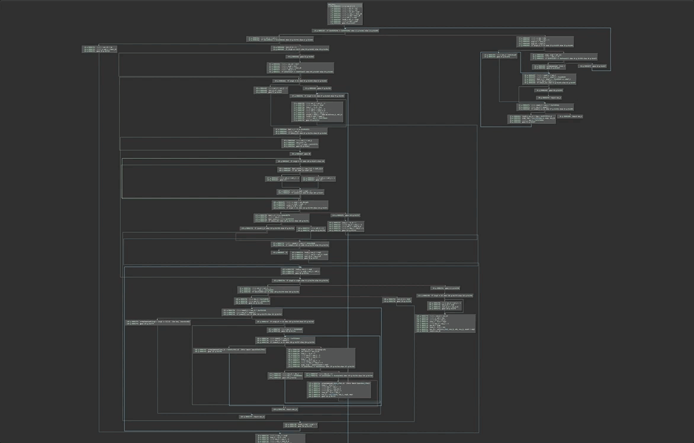

# Opaque Predicate Patcher (v1.1.6)
Author: **Vector 35 Inc**

_Automatically patch opaque predicates_

## Description:

This script will automatically remove conditional branches which have constant conditions. It can be run from the command line via `python -mOpaquePredicatePatcher.__main__` (if the BinaryNinja python library is in your path) or installed as a plugin in your user plugin directory. Read more about how this tool works on our blog: [Automated Opaque Predicate Removal](https://binary.ninja/2017/10/01/automated-opaque-predicate-removal.html)

### Example

## Installation Instructions

### Windows

### Linux

### Darwin

## Minimum Version

This plugin requires the following minimum version of Binary Ninja:

* 0

## Required Dependencies

The following dependencies are required for this plugin:

## License

This plugin is released under a MIT license.
## Metadata Version

2
